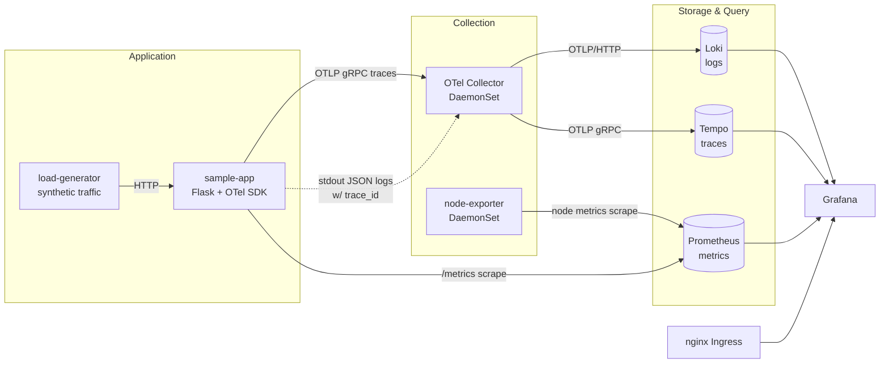

# LGTM Observability Stack on Kubernetes

A self-hosted, correlation-first observability platform for Kubernetes — **L**oki (logs), **G**rafana (visualization), **T**empo (traces), and **M**etrics via Prometheus — deployed from raw manifests with no Helm abstraction to hide what's actually running.

Every log line carries the `trace_id` of the request that produced it, every trace can be jumped to from Grafana with one click, and every metric is scraped via standard Prometheus service discovery. A small instrumented Flask service and a synthetic load generator are included so the whole pipeline produces real signal the moment it's deployed — logs, traces, metrics, and dashboards are all live within minutes of `kubectl apply`.

## Why this exists

Most "observability stack" repos wire up Grafana + Prometheus and call it done. This one exists to demonstrate the part that's usually missing: **correlation**. A JSON-formatted log line is useless during an incident if you can't jump from it to the exact trace and span that generated it. This stack wires that path end-to-end — application → OpenTelemetry Collector → Loki/Tempo → Grafana derived fields — so a `500` in the logs is one click from its full distributed trace.

## Architecture



**How the signals connect:**
- The sample app emits structured JSON logs to stdout and OTLP traces to the Collector, stamping the active span's `trace_id`/`span_id` onto every log record at write time.
- A single **OpenTelemetry Collector**, deployed as a **DaemonSet**, tails pod logs directly off the node's filesystem (`file_log` receiver) and receives OTLP traces — no per-pod sidecar required.
- Metrics use plain Prometheus service discovery (`prometheus.io/scrape` annotations) rather than a metrics pipeline through the Collector — the boring, well-understood path for this signal.
- Grafana's Loki datasource is provisioned with a `derivedFields` regex that turns `trace_id` in a log line into a live link to the matching Tempo trace — configured via `01-grafana/datasources.yaml`, not clicked together by hand.

## What's included

| Component | Role | Image |
|---|---|---|
| **Grafana** | Dashboards & correlated log/trace/metric explorer | `grafana/grafana:11.5.2` |
| **Loki** | Log aggregation, filesystem-backed | `grafana/loki:3.3.2` |
| **Tempo** | Distributed trace storage | `grafana/tempo:2.6.1` |
| **Prometheus** | Metrics TSDB, Kubernetes pod SD | `prom/prometheus:v2.55.1` |
| **node-exporter** | Per-node kernel/hardware metrics | `prom/node-exporter:v1.8.2` |
| **OTel Collector** | Log tailing + OTLP trace pipeline, DaemonSet | `otel/opentelemetry-collector-contrib:0.156.0` |
| **ingress-nginx** | Cluster ingress controller | `registry.k8s.io/ingress-nginx/controller:v1.11.3` |
| **sample-app** | Flask service instrumented with OpenTelemetry + prometheus_client, simulating realistic latency/error profiles per route | custom, built locally |
| **load-generator** | busybox loop driving synthetic traffic across routes | `busybox:1.36` |

## Repository layout

Numbered directories reflect apply order — each stage builds on the one before it:

```
00-namespace/     observability namespace
01-grafana/       Grafana deployment + datasource provisioning (Loki/Tempo/Prometheus wired in)
02-loki/          Loki + the OTel Collector DaemonSet (log & trace pipeline)
03-tempo/         Tempo trace backend
04-prometheus/    Prometheus + RBAC for pod service discovery, node-exporter DaemonSet
05-ingress/       ingress-nginx controller + Grafana Ingress
sample-app/       instrumented Flask app, Dockerfile, Deployment, and a load generator
```

## Quickstart

Requires a local Kubernetes cluster (kind/minikube/k3d) and `kubectl`.

```bash
# 1. Build the sample app image into your cluster's local image store
docker build -t sample-app:v1 sample-app/app
kind load docker-image sample-app:v1   # skip / adjust if not using kind

# 2. Deploy in order
kubectl apply -f 00-namespace/
kubectl apply -f 01-grafana/
kubectl apply -f 02-loki/
kubectl apply -f 03-tempo/
kubectl apply -f 04-prometheus/
kubectl apply -f 05-ingress/
kubectl apply -f sample-app/

# 3. Point grafana.lgtm.local at the ingress controller
echo "127.0.0.1 grafana.lgtm.local" | sudo tee -a /etc/hosts
kubectl port-forward -n ingress-nginx svc/ingress-nginx-controller 8080:80
```

Open `http://grafana.lgtm.local:8080` (default credentials `admin` / `admin`, prompted for reset on first login). The load generator is already producing traffic across `/checkout`, `/login`, `/cart`, and `/inventory` — Explore any log line's `trace_id` field to jump straight into its trace in Tempo.

## Design notes

A few decisions worth calling out, since they're the kind of thing that gets skipped in a demo but matters in practice:

- **Raw manifests, not Helm.** Every resource here is legible in a single file per concern — useful for a reader (or a client) who wants to see exactly what's deployed rather than trust an opaque chart.
- **Log/trace correlation is wired at the source**, not bolted on with a log-parsing regex after the fact — the app itself stamps `trace_id`/`span_id` from the active OTel span context onto each log record.
- **DaemonSet log collection** avoids the sidecar-per-pod tax and matches how most production clusters actually ship logs.
- **Deliberately simplified for a demo footprint**: single replica per component, filesystem-backed storage (no object store), Loki/Tempo running standalone rather than in microservices mode, and Grafana admin credentials left at their default. None of this is a production posture — swapping to S3/GCS-backed storage, multi-replica ingesters, and a real secrets/auth story is the next step, not an oversight.

## Sample app

`sample-app/app/app.py` is a small Flask service with four routes (`/checkout`, `/login`, `/cart`, `/inventory`), each with its own base latency, jitter, and error-rate profile so Grafana dashboards show realistic, differentiated behavior rather than flat lines. It's instrumented with `opentelemetry-instrumentation-flask` for automatic spans plus manual child spans around simulated work, `prometheus_client` for request count/duration metrics, and a custom logging formatter that reads the active trace context at log time.
